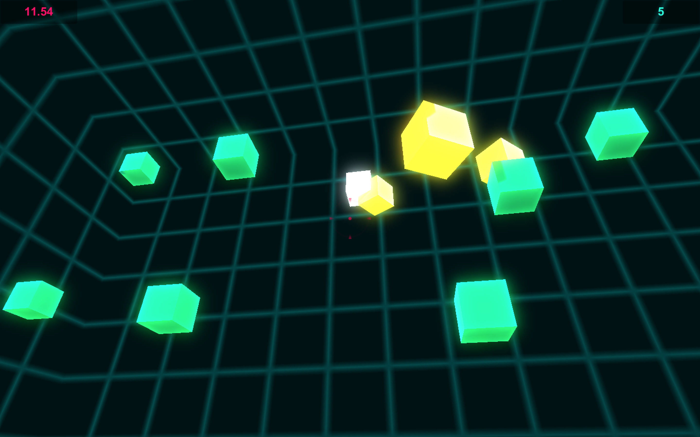
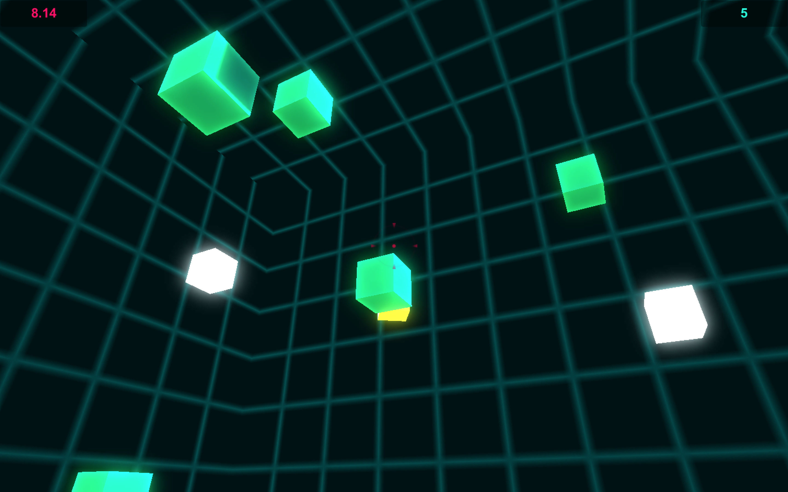
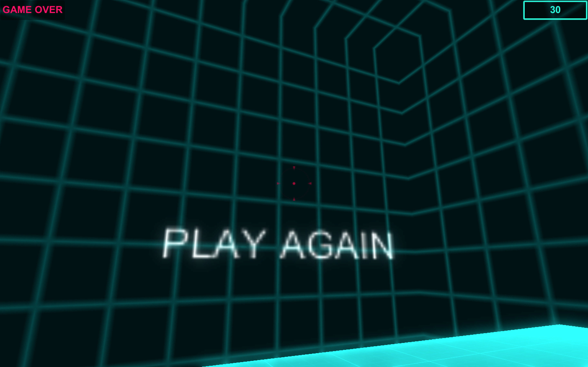

# Box Shooter

## Introduction

This is a first person shooting box game which is powered by Unity 2017.1.1p4.

Game is over when time runs out. Shooting different boxes will get different effects.
* Green Boxes: Get 5 points
* White Boxes: Increase time
* Yellow Boxes: Decrease time

## Control
* Move: WASD
* Shoot: Mouse Left Click

The project is based on a assignment of 《Introduction to Game Development》 offered by Michigan State University via Coursera.

## Screenshots

